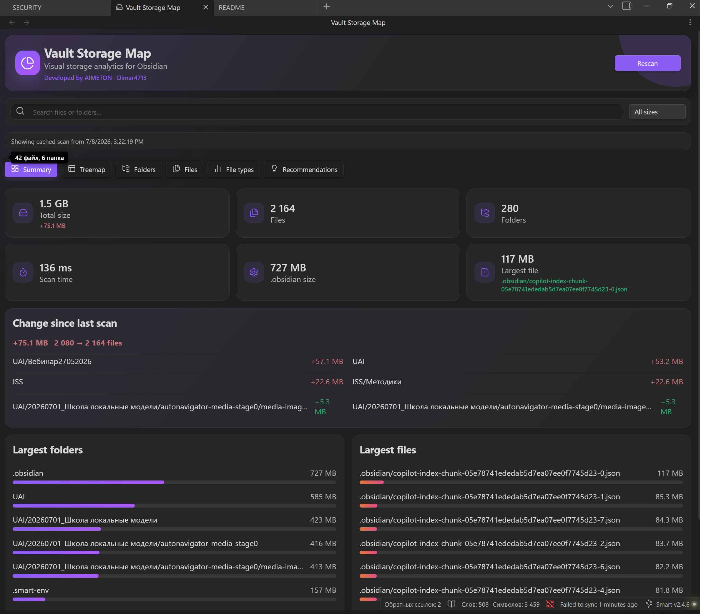
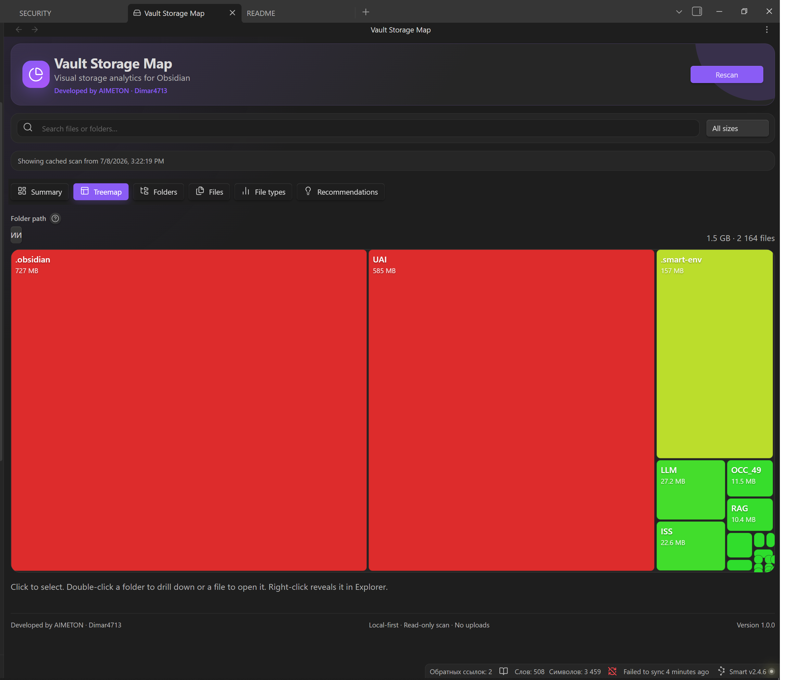
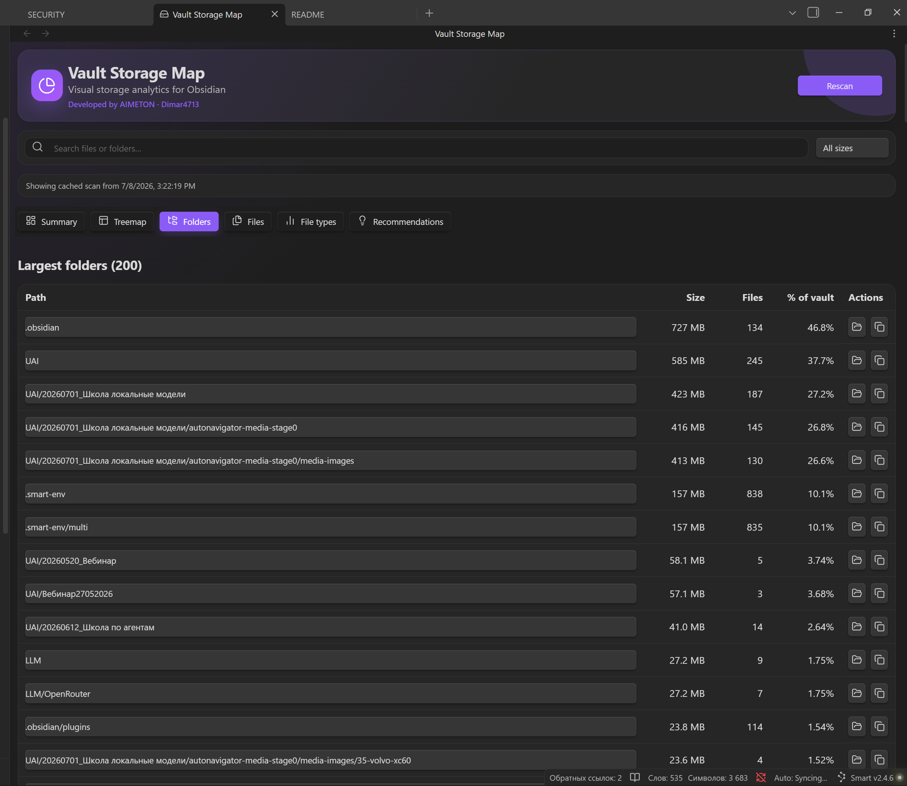
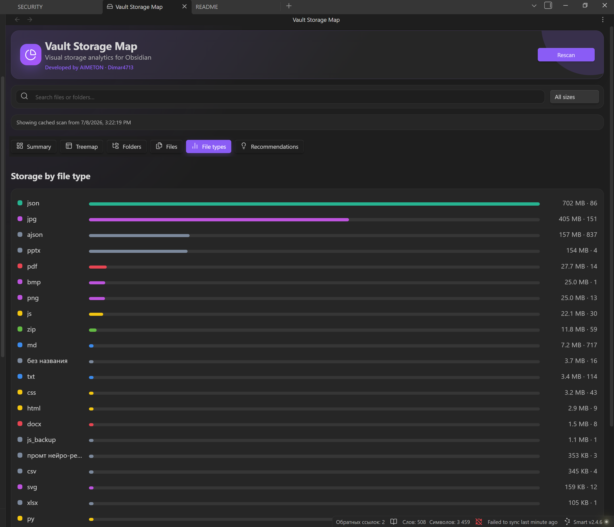

# Vault Storage Map

[English](#english) · [Русский](docs/README.ru.md) · [简体中文](docs/README.zh-CN.md)



## English

**Vault Storage Map** is a local-first desktop plugin that shows where disk space is used inside a vault. It combines an interactive treemap, ranked folder and file tables, file-type statistics, scan comparisons, and diagnostic recommendations.

Developed by **AIMETON · Dimar4713**.

## Features

- Interactive treemap with folder drill-down.
- Largest-folder and largest-file rankings.
- Search and minimum-size filters.
- Compact, collapsible details panel.
- Light, dark, and system themes.
- Cached last scan and comparison with the previous scan.
- Markdown, CSV, and JSON report export.
- Diagnostic warnings for large files, `.obsidian`, Copilot indexes, attachments, and unreadable entries.
- Built-in exclusion of the plugin's own generated cache from scan totals.
- No telemetry, accounts, network requests, or automatic deletion.






## Interface languages

The interface supports automatic language detection and manual selection:

- English
- Русский
- 简体中文
- Français
- Deutsch
- Español
- Italiano
- Türkçe
- हिन्दी
- বাংলা
- தமிழ்
- Português

Community proofreading is welcome, especially for Hindi, Bengali, and Tamil. See [TRANSLATIONS.md](TRANSLATIONS.md).

## Privacy and file access

Scanning is read-only. The plugin reads filesystem metadata such as paths, sizes, file types, modification dates, and directory counts. It does not read note contents for storage analysis and does not send vault data over the network.

The plugin may write only when needed:

- `data.json` for settings;
- `storage-cache-v1.json` for the optional local scan cache;
- Markdown, CSV, or JSON reports after an explicit export command.

The generated cache is excluded from the plugin's own scan totals.

## Requirements

- Desktop application only.
- A vault backed by a local filesystem path.
- Minimum app version declared in the manifest: `1.6.0`.

Symbolic links are not followed by default. Enabling them can scan outside the vault and requires care.

## Installation

### Community Plugins

After acceptance into the official directory:

1. Open **Settings → Community plugins → Browse**.
2. Search for **Vault Storage Map**.
3. Select **Install**, then **Enable**.

### BRAT beta

1. Install the BRAT plugin.
2. In BRAT settings, choose **Add Beta Plugin**.
3. Enter the repository URL: `https://github.com/Dimar4713/vault-storage-map`.
4. Enable **Vault Storage Map**.

### Manual installation

Download `main.js`, `manifest.json`, and `styles.css` from the matching GitHub release and copy them to:

```text
<Vault>/.obsidian/plugins/vault-storage-map/
```

Then reload the application and enable the plugin.

## Usage

1. Click the hard-drive ribbon icon or run **Open storage map**.
2. Select **Scan vault**.
3. Explore the summary, treemap, folders, files, file types, and recommendations.
4. Click a row or treemap block for details.
5. Export a report when needed.

## Development

```bash
npm install
npm run check
npm run build
```

The production bundle is written to `main.js`.

## Support and contributions

Use GitHub Issues for bug reports, feature requests, and translation corrections. Please include the app version, operating system, plugin version, approximate vault size, and relevant console errors.

## License

MIT. See [LICENSE](LICENSE).
